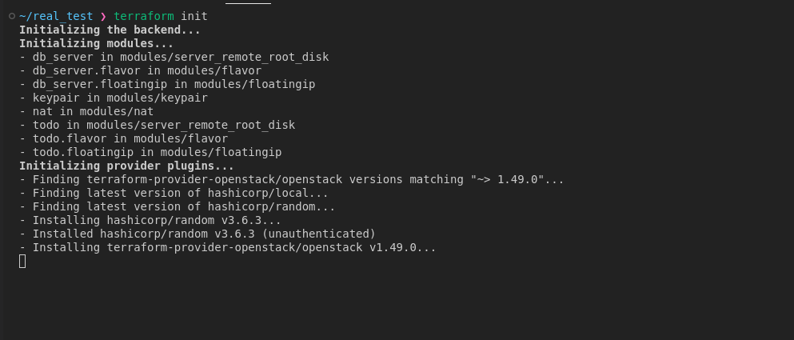
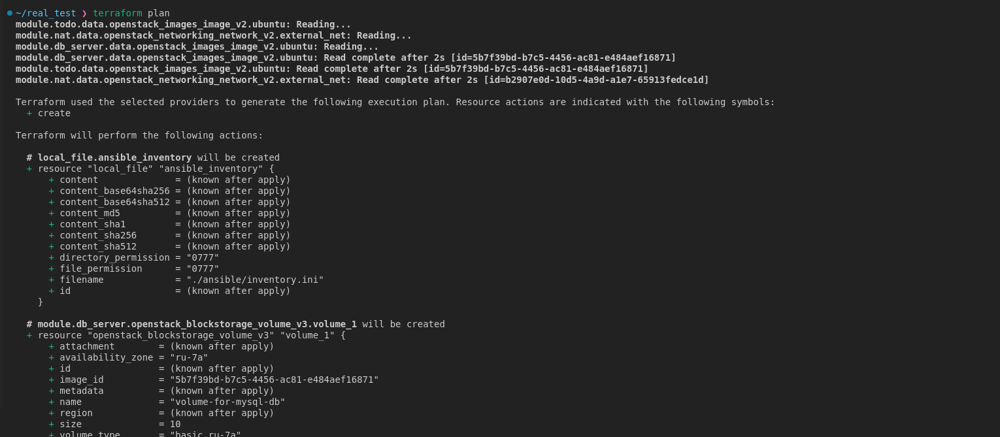
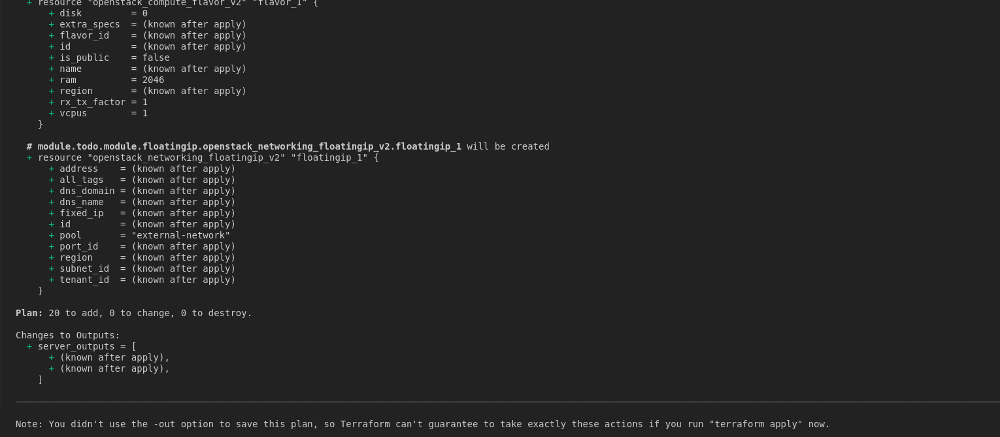
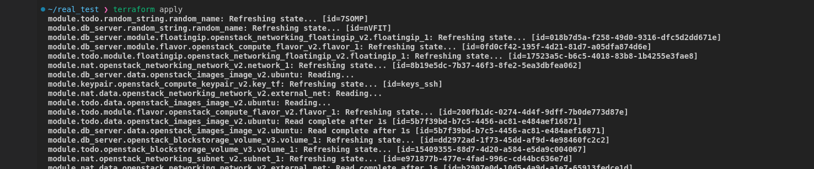
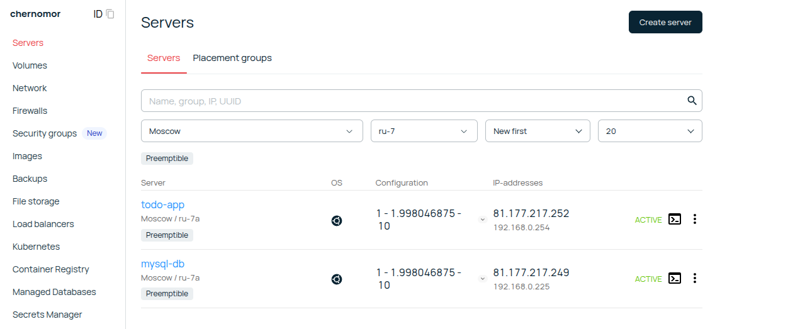
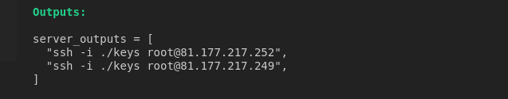
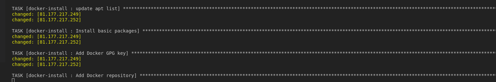
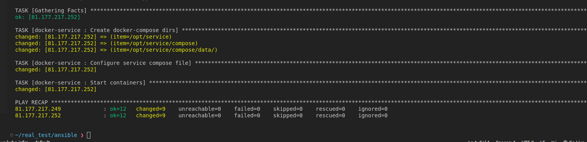

# Практическое задание, работа с Terraform и Ansible

Для работы были взяты модули terraform из репозитория с описанием задачи.

Для работы с репозиторием необходимо склонировать его.

Затем создать в той же папке ssh ключи, командой *ssh-keygen -t rsa* и назвать ключи keys и keys.pub.

Сначала необходимо выполнить инициализацию терраформ модулей

Так как все чувствительные переменные скрыты в публичном репозитории, необходимо создать файл .tfvars или вводить переменные 
для авторизации вручную, в моем случае был использован файл terraform.tfvars

Перед применением команды terraform apply необходимо проверить план выполнения.

После проверки плана можно выполнить команду terraform apply

Проверим, что машины созданы в веб интерфейсе

Теперь к ним можно подключиться по ssh

Запустим ansible

Проверим, что приложение работает

